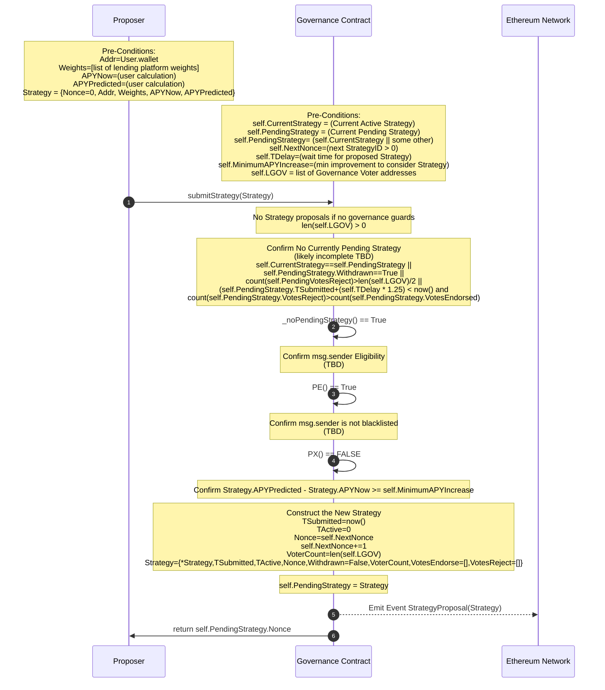
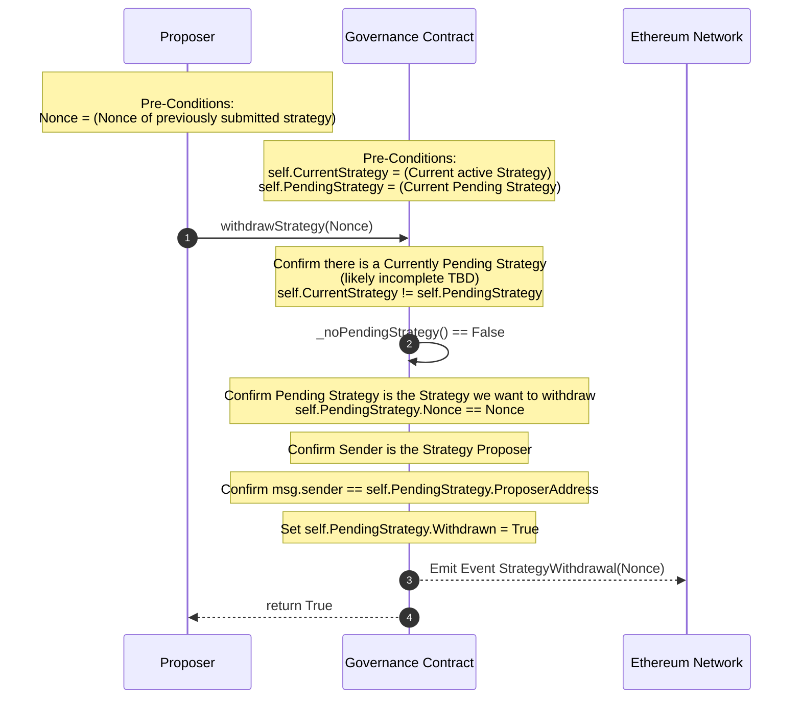
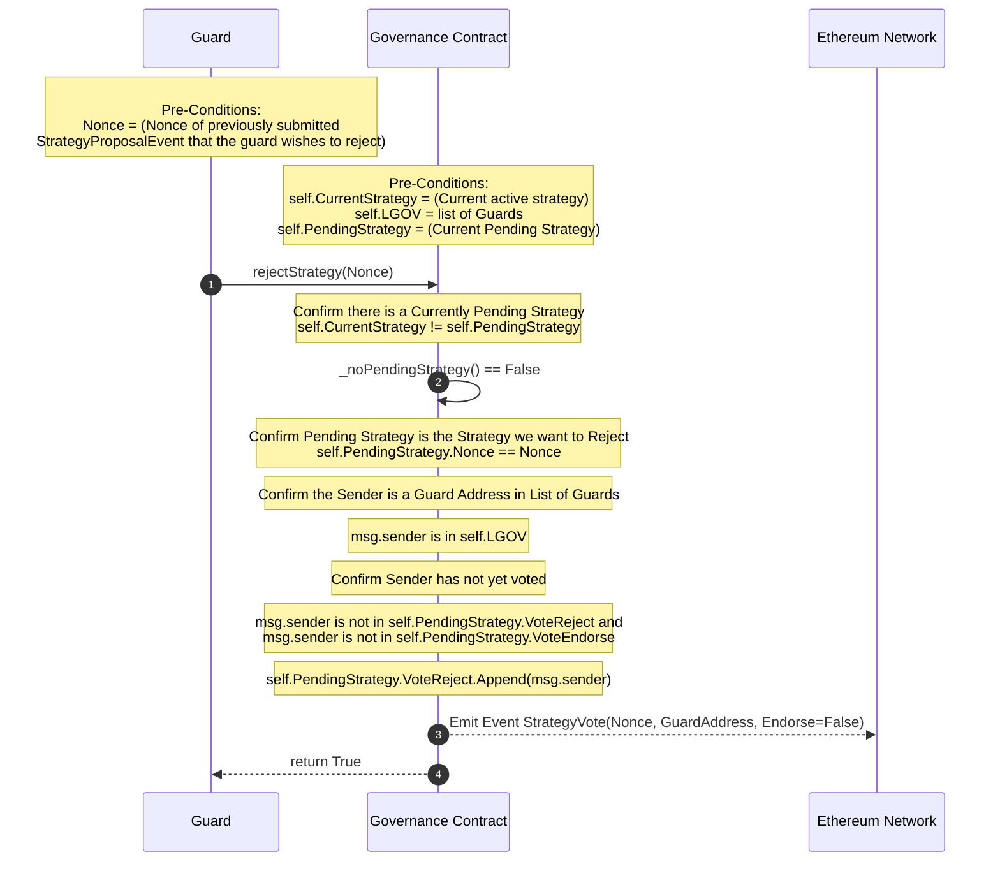
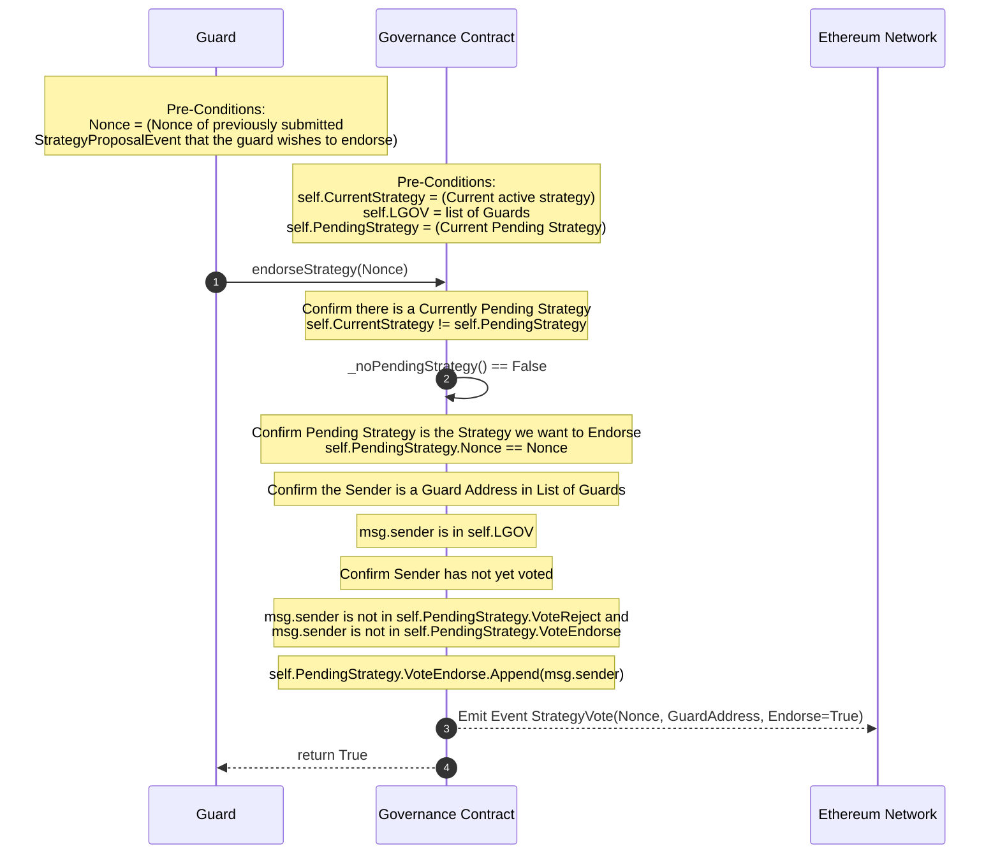
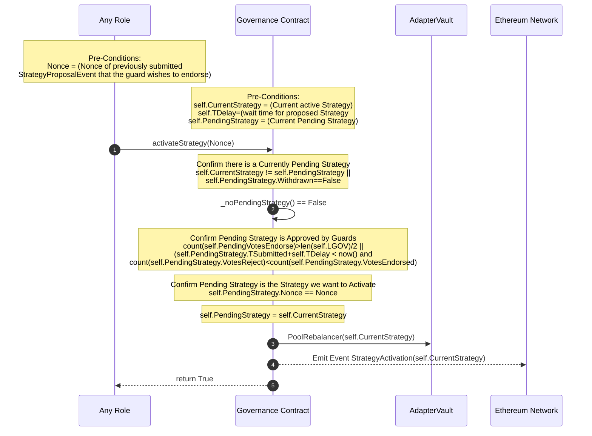
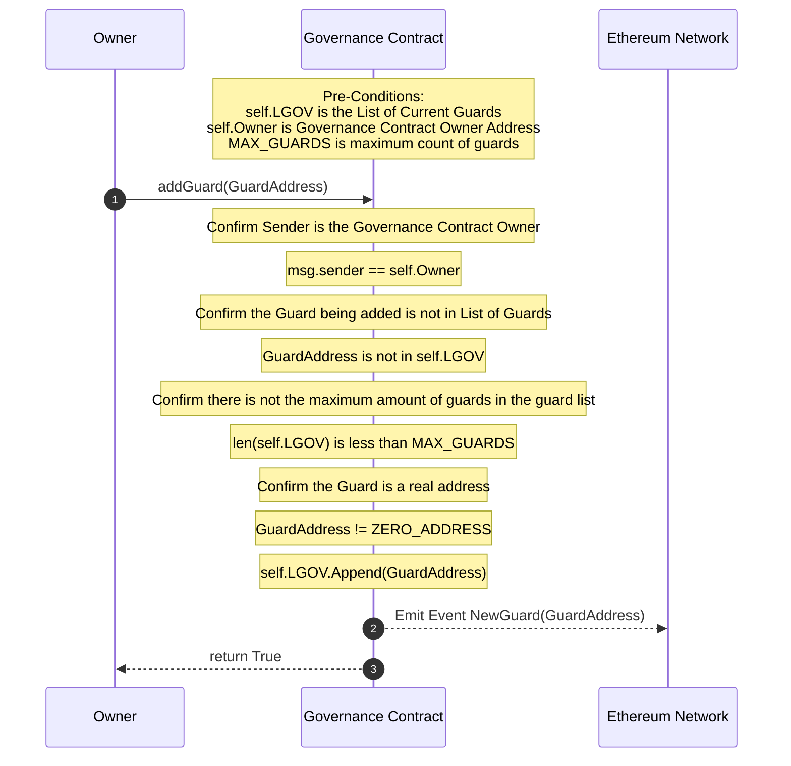
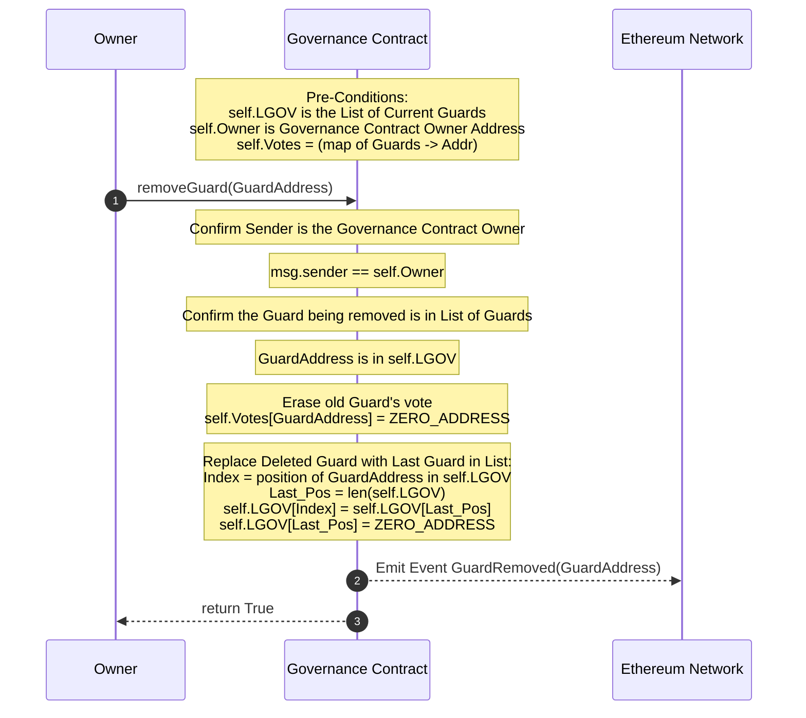
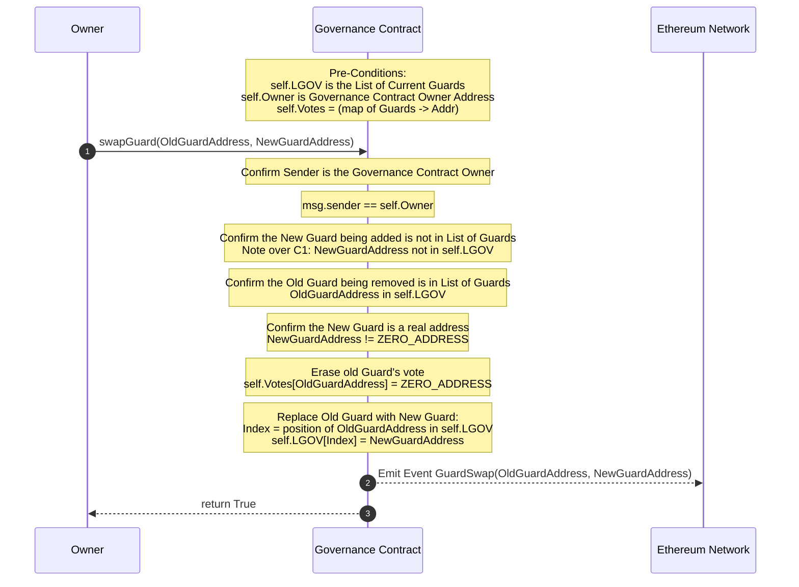
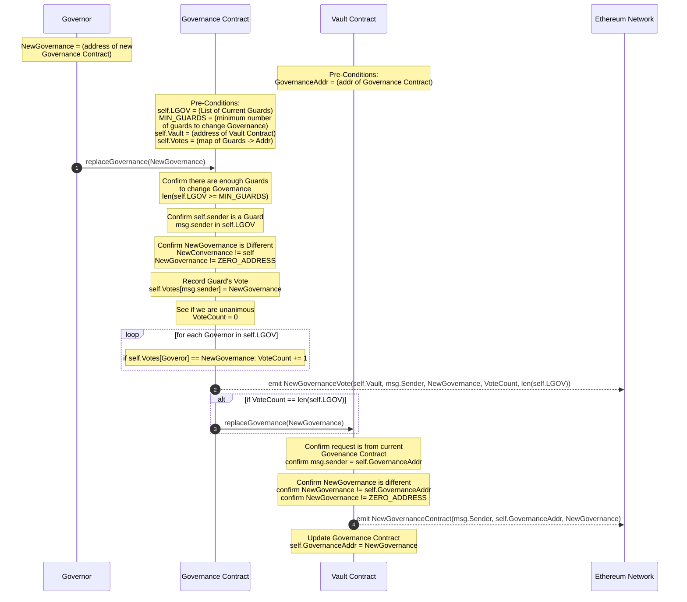

# Adapter.Fi <-> Governance Contract

## Summary

The Adapter.Fi protocol crowd sources optimal wealth allocations across various liquidity/lending platforms. Such an
allocation, proposed or active, is called a Strategy. The expectation that just about anyone is allowed to propose a Strategy introduces a likely significantly higher rate of submissions across the Ethereum ecosystem. The typical voting method of deciding which decision to make is both unweildy and would require far too much active participation by others who have investments in the Adapter.Fi protocol. On the other hand, if the protocol has no restrictions on who and when Strategies can be proposed nor a process in which to edjudicate their acceptance, bad actors could use this openess as a vector to attempt denial of service attacks that would break down then entire value of the protocol. 

Adapter.Fi has adopted a Governance policy that is optimistic in assuming most submitted Strategies are valid so, unless someone involved in Governance makes the effort to reject a Strategy, it will ultimately be accepted and activated in a reasonable period of time. To protect against bad actors, however, there is a "decision period" that starts when a new Strategy is proposed in which a select group of Governance Guards may choose to block an invalid Strategy. Optionally, the Guards may even short circuit the waiting time by having an absolute majority vote to endorse the Strategy so it may be activated right away. 

This DAO-like governance model assumes Strategies proposed are valid and should be accepted by default. Guards need only intervene if a proposed Strategy appears to be something other than it claims to be or if there is an exceptional situation where either market forces or ecosystem issues introduce an urgency for the existing active Strategy to be replaced as quickly as possible. 

### Proposing a Strategy

To propose a new Strategy, four conditions must be met:
1) The Proposer must meet the qualifications to make a proposal. (PE - see below.)
2) The Proposer must not be subject to some explicit prohibition from submitting strategies. (PX - see below.)
3) There must not be a proposed Strategy that is still pending during the "decision period" or "activation period".
4) The proposed Strategy must meet certain criteria in terms of minimum margin of improvement requirements.

A proposed Strategy contains both the wealth allocation recommendations as well as the claims for what the current Strategy's yield, APYCURRENT, is and what the proposed Strategy's yield, APYPROPOSED, would be. The Governance DAO contract will confirm the first three conditions authoritatively. So long as APYPROPOSED - APYCURRENT > the minimum improvement, APYDELTA, then condition #4 is assumed to be met by the Governance DAO contract but it assumes that external Guards will check that the claims are within spec and take action to prevent its activation if not.

The "decision period" now starts and no other Strategy can be proposed until this one is properly adjudicated.

#### submitStrategy

*Given:*

PE = Predicate - Proposer must meet certain qualification for eligibility. (Must resolve to True)

- Ex: hold a certain quantity of vault tokens. TBD

PX = Predicate - Proposer must not be subject to some form of exclusion. (Must resolve to False)

- Ex: having been rejected in last 24 hrs or on a black list. TBD

TDELAY = Variable - How long after a strategy is submitted until it can be activated so long as it is not rejected/overwhelmingly endorsed.

MAX_GUARDS = Constant - Maximum number of Guards who may vote on Proposed Strategies.

LGOV[MAX_GUARDS] = Variable - List of addresses of Governance Guards who vote on Strategy Submissions.

Strategy = (Proposed) Struct = { Nonce, Proposer Addr, Weights[], TSUBMITTED, TACTIVATED, Withdrawn, len(LGOV), VotesENDORSE, VotesREJECT }

### Withdrawing a Strategy

If there is a Pending Strategy, the **original proposer** may elect to withdraw it at any time so that a new Strategy proposal can replace it. 

#### withdrawStrategy

### Evaluating and Interceding on a Proposed Strategy

Adapter.Fi will operate bots that watch for StrategyProposal events and then also perform the calculations for determining the APYPROPOSED - APYCURRENT values for current and proposed Strategies. If the values resulting from the proposed Strategy's inputs coincide with the claimed values in the proposed Strategy as submitted then the bots can do nothing. If the values are significantly out of bounds then the bots will alert that the proposed Strategy is likely invalid so that Guards can decide to re-evaluate the proposed Strategy and reject the proposal if desired. 

A single rejection is enough to block a Proposed Strategy from being active if no other votes are made regarding the Proposed Strategy. If there is any rejection vote, the only way a Proposed Strategy can be enabled is for there to be a majority of Endorsement votes. Tied votes still result in a rejection. 

An absolute majority vote can enable the Proposed Strategy to short circuit the "decision period" time. At the time a Proposed Strategy is submitted, the number of Guards eligible to vote is tracked by the Proposed Strategy so that the potential vote count is known. Guards may be added or removed from the Governance Contract but the vote count that matters is based on the potential votes at the time the Proposed Strategy is submitted. If more than half the total potential votes are cast for rejection then a new Proposed Strategy may be submitted without waiting for the "decision period" to expire. If more than half the total potential votes are cast for endorsement then the current Proposed Strategy may be activated right away.

Guards may only vote once on a Proposed Strategy during the "activation period" and may not change their votes.

TODO?: In order to provide an absolute protection against on-going DOS race condition attacks by bad actors constantly proposing new Strategies, we could add an optional Strategy parameter to the `rejectStrategy` method which, if this reject vote results in an absolute rejection count, would immediately short circuit the waiting period and submit the new Strategy as a new Proposed Strategy. This may not be necessary if the predicates PE and PX are strong enough controls. It may also be the case, in the future, that Adapter.Fi may want a more strict separation of concerns and disallow Governance Guards to submit Strategies or vote on Strategies they've submitted - but this may not be practical in a true decentralized environment.

#### rejectStartegy

*Given:*

TDELAY = Variable - How long after a strategy is submitted until it can be activated so long as it is not rejected/overwhelmingly endorsed.

MAX_GUARDS = Constant - Maximum number of Guards who may vote on Proposed Strategies.

LGOV[MAX_GUARDS] = Variable - List of addresses of Governance Guards who vote on Strategy Submissions.

Strategy = (Proposed) Struct = { Nonce, Proposer Addr, Weights[], TSUBMITTED, TACTIVATED, Withdrawn, len(LGOV), VotesENDORSE, VotesREJECT }

#### endorseStartegy

*Given:*

TDELAY = Variable - How long after a strategy is submitted until it can be activated so long as it is not rejected/overwhelmingly endorsed.

MAX_GUARDS = Constant - Maximum number of Guards who may vote on Proposed Strategies.

LGOV[MAX_GUARDS] = Variable - List of addresses of Governance Guards who vote on Strategy Submissions.

Strategy = (Proposed) Struct = { Nonce, Proposer Addr, Weights[], TSUBMITTED, TACTIVATED, Withdrawn, len(LGOV), VotesENDORSE, VotesREJECT }

### Activating a Proposed Strategy

Assuming either no reject votes have occurred or a majority of votes for endorsement have been registered and either the "decision period" has passed or been short circuited, a new "activation period" starts which gives time for someone to make an activateStrategy call against the Governance Contract to make the Proposed Strategy the new Active Strategy. That time period is set to 25% of the "decision period" time. During this time no other Proposed Strategy can be submitted so long as the pending Proposed Strategy remains inactive. Note that ANYONE can call the `activateStrategy` function which credits the original proposer in terms of rewards but the actor making the function call pays the gas price for the function call and necessary rebalancing of the funds which could be expensive. 

Note that there is no expiration time for calling `activateStrategy` so long as the Proposed Strategy is still eligible. It does not matter if the "activation period" has passed. Until such time that a new Proposed Strategy is in place, the present one may be activated at will.

#### activateStrategy

*Given:*

TDELAY = Variable - How long after a strategy is submitted until it can be activated so long as it is not rejected/overwhelmingly endorsed.

MAX_GUARDS = Constant - Maximum number of Guards who may vote on Proposed Strategies.

LGOV[MAX_GUARDS] = Variable - List of addresses of Governance Guards who vote on Strategy Submissions.

Strategy = (Proposed) Struct = { Nonce, Proposer Addr, Weights[], TSUBMITTED, TACTIVATED, Withdrawn, len(LGOV), VotesENDORSE, VotesREJECT }

### Governance of Governance

The Governance Contract Owner may add or remove Guards at will up to the limit of MAX_GUARDS.
The Governance Contract may be replaced with another one if 100% of all Guards vote to change to the same new Governance Contract. 

#### addGuard

*Given:*

Owner = Variable - Address of Governance Contract Owner

MAX_GUARDS = Constant - Maximum number of Guards who may vote on Proposed Strategies.

LGOV[MAX_GUARDS] = Variable - List of addresses of Governance Guards who vote on Strategy Submissions.

#### removeGuard

*Given:*

Owner = Variable - Address of Governance Contract Owner

MAX_GUARDS = Constant - Maximum number of Guards who may vote on Proposed Strategies.

LGOV[MAX_GUARDS] = Variable - List of addresses of Governance Guards who vote on Strategy Submissions.

Votes = map of Guard addr -> Contract Addr for votes on Governance Contract for Vault

#### swapGuard

*Given:*

Owner = Variable - Address of Governance Contract Owner

MAX_GUARDS = Constant - Maximum number of Guards who may vote on Proposed Strategies.

LGOV[MAX_GUARDS] = Variable - List of addresses of Governance Guards who vote on Strategy Submissions.

Votes = map of Guard addr -> Contract Addr for votes on Governance Contract for Vault

#### replaceGovernance

*Given:*

MAX_GUARDS = Constant - Maximum number of Guards who may vote on Proposed Strategies.
MIN_GUARDS = Contact - Minimum number of Guards which must exist for a Governance Contract change to even occur.

LGOV[MAX_GUARDS] = Variable - List of addresses of Governance Guards who vote on Strategy Submissions.

Vault = address of Vault Contract which this contract provides governance over.

Votes = map of Guard addr -> Contract Addr for votes on Governance Contract for Vault

